# toe / xoxo / someone give me a better name

## Project Overview

> [!IMPORTANT]
> All of the things here are subject to change

This project is a feature-rich, multiplayer Tic-Tac-Toe game with advanced AI,
real-time multiplayer capabilities, and comprehensive user management. The game
extends beyond traditional 3x3 grids to support infinite grids with 5-in-a-row
win conditions.

## Getting Started

> [!TIP]
> Recommended to use pnpm.

```bash
npm i
npm run dev
```

Open [http://localhost:3001](http://localhost:3001) with your browser to see the
result.

## Flowchart of System Design

```mermaid
   flowchart TD
      Start(["🎮 Game Start"]) -- start --> AuthCheck{"🔐 Authentication"}
      AuthCheck -- not logged in --> AuthChoice{"👤 Account Options"}
      AuthCheck -- logged in --> Menu{"📋 Main Menu"}
      AuthChoice -- traditional --> Login["🔑 Login"] & Register["📝 Register"]
      AuthChoice -- oauth --> OAuthLogin["🌐 OAuth2 Login"]
      AuthChoice -- skip --> GuestMode["👻 Continue as Guest"]
      Login -- form --> LoginForm["🔑 Traditional Login<br>• Username/Email<br>• Password<br>• Remember Me<br>• Forgot Password"]
      Register -- form --> RegisterForm["📝 Traditional Registration<br>• Username<br>• Email<br>• Password<br>• Confirm Password"]
      OAuthLogin -- providers --> OAuthProviders["🌐 OAuth2 Providers<br>• Google<br>• Discord"]
      OAuthProviders -- oauth flow --> OAuthFlow["🔐 OAuth2 Flow<br>• Redirect to Provider<br>• User Authorization<br>• Authorization Code<br>• Exchange for Tokens"]
      OAuthFlow -- validate --> OAuthValidation{"✅ OAuth2 Success?"}
      OAuthFlow -- api call --> AuthAPI["🌐 REST API<br>POST /auth/login<br>POST /auth/register<br>POST /auth/refresh<br>DELETE /auth/logout<br>POST /auth/oauth/google<br>POST /auth/oauth/discord<br>GET /auth/oauth/callback<br>POST /auth/link-account<br>DELETE /auth/unlink-account"]
      OAuthValidation -- success --> AccountLinking{"🔗 Account Exists?"}
      OAuthValidation -- failed --> OAuthError["❌ OAuth2 Failed<br>• Network Error<br>• User Cancelled<br>• Invalid Credentials"]
      OAuthError -- retry --> AuthChoice
      AccountLinking -- existing --> Menu
      AccountLinking -- new user --> OAuthProfile["📝 Complete Profile<br>• Choose Username<br>• Verify Email<br>• Set Preferences<br>• Auto-create Account"]
      OAuthProfile -- complete --> Menu
      LoginForm -- validate --> AuthValidation{"✅ Valid Credentials?"}
      LoginForm -- api call --> AuthAPI
      RegisterForm -- validate --> RegValidation{"✅ Valid Registration?"}
      RegisterForm -- api call --> AuthAPI
      AuthValidation -- success --> Menu
      AuthValidation -- failed --> AuthError["❌ Login Failed"]
      RegValidation -- success --> Menu
      RegValidation -- failed --> RegError["❌ Registration Failed"]
      AuthError -- retry --> Login
      RegError -- retry --> Register
      GuestMode -- continue --> Menu
      Menu -- check access --> ModeCheck{"🔐 User Type"}
      ModeCheck -- authenticated --> FullMenu["📋 Full Menu<br>• Single Player<br>• Play with Bot<br>• Multiplayer<br>• Profile &amp; Settings"]
      ModeCheck -- guest --> GuestMenu["👻 Guest Menu<br>• Single Player Only<br>• Play with Bot Only"]
      FullMenu -- local --> Single["👤 Single Player"]
      FullMenu -- ai --> Bot["🤖 Play with Bot"]
      FullMenu -- online --> Multi["🌐 Multiplayer"]
      FullMenu -- account --> Profile["👤 Profile & Settings"]
      GuestMenu -- local --> Single
      GuestMenu -- ai --> Bot
      Profile -- profile --> ProfileSystem["👤 Profile System<br>• User Statistics<br>• Match History<br>• Account Settings<br>• OAuth2 Linking<br>• Security Settings<br>• Logout Option"]
      ProfileSystem -- back --> Menu
      ProfileSystem -- api call --> UserAPI["🌐 REST API<br>GET /users/:id/profile<br>GET /users/:id/stats<br>GET /users/:id/history<br>PUT /users/:id/settings<br>GET /users/:id/linked-accounts<br>POST /users/:id/link-oauth<br>DELETE /users/:id/unlink-oauth"]
      ProfileSystem -- manage --> AccountManagement["⚙️ Account Management"]
      AccountManagement -- link --> LinkOAuth["🔗 Link OAuth2 Account<br>• Connect Google<br>• Connect Discord"]
      AccountManagement -- unlink --> UnlinkOAuth["❌ Unlink OAuth2<br>• Remove Connection<br>• Confirm Action<br>• Security Warning"]
      AccountManagement -- password --> ChangePassword["🔒 Change Password<br>• Current Password<br>• New Password<br>• Confirm Password"]
      LinkOAuth -- oauth flow --> OAuthProviders
      UnlinkOAuth -- return --> ProfileSystem
      ChangePassword -- return --> ProfileSystem
      Single -- start local --> GameBoard["🎲 Game Board"]
      Bot -- ai setup --> BotAI["🧠 Bot AI System"]
      BotAI -- start game --> GameBoard
      Multi -- multiplayer --> MultiChoice{"🔗 Multiplayer Options"}
      MultiChoice -- create --> CreateRoom["🏠 Create Private Room"]
      MultiChoice -- join private --> JoinRoom["🚪 Join Private Room"]
      MultiChoice -- matchmaking --> QuickMatch["⚡ Quick Match"]
      MultiChoice -- browse --> BrowseLobby["🏛️ Browse Public Lobby"]
      CreateRoom -- room created --> RoomCreated["🏠 Room Created<br>• Generate 6-char Room ID<br>• Display Room Code<br>• Copy Share URL<br>• Share with Friend"]
      RoomCreated -- configure --> GameSettings["⚙️ Game Settings<br>• Choose Grid Size (3x3, 5x5, Custom)<br>• Win Condition (3-in-a-row, 5-in-a-row)<br>• Time Limits (Optional)<br>• Turn Indicators<br>• Visual Preferences"]
      GameSettings -- wait for player --> WaitOpponent["⏳ Wait for Opponent"]
      GameSettings -- local start --> GameBoard
      JoinRoom -- enter code --> EnterRoomCode["🔢 Enter Room Code<br>• Input 6-character ID<br>• Validate Format"]
      EnterRoomCode -- validate --> RoomValidation{"🔍 Valid Room?"}
      RoomValidation -- invalid --> RoomError["❌ Room Error<br>• Invalid Code<br>• Room Full<br>• Room Expired"]
      RoomValidation -- valid --> WaitOpponent
      QuickMatch -- queue --> Matchmaking["🎯 Matchmaking System<br>• Skill-based Matching<br>• Queue Management<br>• Auto Room Creation<br>• Player Rating Analysis"]
      Matchmaking -- search --> MatchFound{"👥 Match Found?"}
      Matchmaking -- cache --> RedisCache["🔴 Redis Cache<br>• Active Game Rooms &amp; States<br>• Lobby &amp; Player Presence<br>• Matchmaking Queue<br>• Socket.IO Adapter<br>• Player Sessions (TTL)<br>• OAuth2 State Cache<br>• Spectator Lists<br>• Room Metadata"]
      Matchmaking -- api call --> UserAPI
      MatchFound -- found --> WaitOpponent
      MatchFound -- keep waiting --> Matchmaking
      BrowseLobby -- lobby --> LobbySystem["🏛️ Lobby System<br>• Active Games List<br>• Player Presence<br>• Room Spectating<br>• Join Public Games"]
      LobbySystem -- action --> LobbyAction{"🎮 Lobby Action"}
      LobbySystem -- cache --> RedisCache
      LobbyAction -- join --> JoinPublicGame["🚪 Join Public Game"]
      LobbyAction -- spectate --> SpectateGame["👁️ Spectate Game"]
      LobbyAction -- back --> BackToLobby["🔙 Back to Lobby"]
      JoinPublicGame -- configure --> GameSettings
      SpectateGame -- watch --> SpectatorMode["👁️ Spectator View"]
      BackToLobby -- return --> LobbySystem
      SpectatorMode -- return --> LobbySystem
      WaitOpponent -- start game --> GameBoard
      RoomError -- back --> Menu
      GameBoard -- game logic --> GameLogic["🧮 Game Logic<br>• Turn System<br>• Win Detection<br>• Move Validation"]
      GameBoard -- ui --> UISystem["🎨 UI System<br>• PIXI.js Canvas<br>• Infinite Grid<br>• Zoom &amp; Pan Controls<br>• Animations"]
      GameBoard -- network --> NetworkLayer{"🌐 Network Layer?"}
      NetworkLayer -- multiplayer --> SocketIO["🔌 Socket.IO<br>• Real-time Sync<br>• Room Management<br>• Auto Reconnection<br>• JWT Token Validation"]
      NetworkLayer -- local/bot --> LocalPlay["🏠 Local Gameplay"]
      LocalPlay -- setup --> LocalGameSetup["⚙️ Local Game Setup<br>• Player Names (Player 1 vs Player 2)<br>• Load from localStorage"]
      LocalGameSetup -- configure --> GameSettings
      SocketIO -- cache --> RedisCache
      SocketIO -- events --> RealtimeFlow["⚡ Socket.IO Events<br>• game:make-move<br>• room:join/leave<br>• lobby:update<br>• matchmaking:queue<br>• spectator:join/leave<br>• auth:token-refresh"]
      AuthAPI -- store --> PostgresDB["🐘 PostgreSQL<br>• User Accounts &amp; Profiles<br>• Authentication Data (JWT &amp; OAuth2)<br>• OAuth2 Provider Links<br>• Match History &amp; Results<br>• Player Statistics &amp; Rankings<br>• Leaderboards<br>• User Settings &amp; Preferences<br>• Security Logs<br>• Admin &amp; Moderation Data"]
      AuthAPI -- endpoints --> APIFlow["🌐 REST Endpoints<br>• JWT Authentication<br>• OAuth2 Integration<br>• User CRUD Operations<br>• Account Linking/Unlinking<br>• Statistics &amp; Analytics<br>• Leaderboard Data<br>• Security Features<br>• Admin Functions"]
      UserAPI -- store --> PostgresDB
      UserAPI -- endpoints --> APIFlow
      RealtimeFlow -- cache --> RedisCache
      MatchAPI["🌐 REST API<br>POST /matches<br>GET /leaderboard<br>GET /match/:id<br>GET /stats/global"] -- endpoints --> APIFlow
      MatchAPI -- store --> PostgresDB
      MatchAPI -- rematch --> RematchFlow{"🔄 Rematch?"}
      APIFlow -- persist --> PostgresDB
      RedisCache -- match complete --> MatchAPI
      UserAPI -. load stats cache .-> RedisCache
      RedisCache -- cleanup --> RedisCleanup["🧹 Auto Cleanup"]
      GameLogic -- check --> GameEnd{"🏁 Game Over?"}
      GameEnd -- continue --> GameBoard
      GameEnd -- finished --> PostGameFlow["🎯 Post-Game<br>• Results Display<br>• Rating Changes<br>• Rematch Options<br>• Exit to Menu"]
      PostGameFlow -- check mode --> LocalCheck["🏠 Local Game?"]
      LocalCheck -- local --> LocalStorage["💾 Save to sessionStorage<br>• Game Results<br>• Session Stats<br>• Player Preferences"]
      LocalCheck -- online --> SaveMatch["💾 Save Match Data"]
      LocalStorage -- rematch --> RematchFlow
      SaveMatch -- api call --> MatchAPI
      RematchFlow -- local rematch --> LocalGameSetup
      RematchFlow -- online rematch --> GameSettings
      RematchFlow -- exit --> Menu
      AuthCheck:::authSystem
      Menu:::flowControl
      Login:::authSystem
      Register:::authSystem
      OAuthLogin:::oauthSystem
      LoginForm:::authSystem
      RegisterForm:::authSystem
      OAuthProviders:::oauthSystem
      OAuthFlow:::oauthSystem
      OAuthValidation:::oauthSystem
      AuthAPI:::apiSystem
      AccountLinking:::oauthSystem
      OAuthError:::authSystem
      OAuthProfile:::oauthSystem
      AuthValidation:::authSystem
      RegValidation:::authSystem
      ModeCheck:::flowControl
      FullMenu:::guestRestriction
      GuestMenu:::guestRestriction
      Single:::gameMode
      Bot:::gameMode
      Multi:::gameMode
      Profile:::authSystem
      ProfileSystem:::authSystem
      UserAPI:::apiSystem
      AccountManagement:::oauthSystem
      LinkOAuth:::oauthSystem
      UnlinkOAuth:::oauthSystem
      ChangePassword:::authSystem
      GameBoard:::flowControl
      BotAI:::aiFeature
      MultiChoice:::multiFeature
      QuickMatch:::multiFeature
      BrowseLobby:::multiFeature
      RoomCreated:::multiFeature
      GameSettings:::gameMode
      WaitOpponent:::multiFeature
      EnterRoomCode:::multiFeature
      Matchmaking:::multiFeature
      MatchFound:::multiFeature
      RedisCache:::database
      LobbySystem:::multiFeature
      LobbyAction:::flowControl
      JoinPublicGame:::multiFeature
      SpectateGame:::multiFeature
      SpectatorMode:::multiFeature
      GameLogic:::coreSystem
      UISystem:::coreSystem
      NetworkLayer:::flowControl
      SocketIO:::multiFeature
      LocalPlay:::localSystem
      LocalGameSetup:::localSystem
      RealtimeFlow:::realtimeSystem
      PostgresDB:::database
      APIFlow:::apiSystem
      MatchAPI:::apiSystem
      RematchFlow:::flowControl
      RedisCleanup:::realtimeSystem
      GameEnd:::flowControl
      PostGameFlow:::coreSystem
      LocalCheck:::flowControl
      LocalStorage:::localSystem
      SaveMatch:::database
      classDef gameMode fill:#e1f5fe,stroke:#01579b,stroke-width:2px
      classDef aiFeature fill:#f3e5f5,stroke:#4a148c,stroke-width:2px
      classDef multiFeature fill:#e8f5e8,stroke:#1b5e20,stroke-width:2px
      classDef coreSystem fill:#fff3e0,stroke:#e65100,stroke-width:2px
      classDef flowControl fill:#f9f9f9,stroke:#424242,stroke-width:2px
      classDef authSystem fill:#ffebee,stroke:#c62828,stroke-width:2px
      classDef oauthSystem fill:#e8f5e8,stroke:#2e7d32,stroke-width:2px
      classDef localSystem fill:#fff9c4,stroke:#f57f17,stroke-width:2px
      classDef database fill:#e0f2f1,stroke:#004d40,stroke-width:3px
      classDef realtimeSystem fill:#e3f2fd,stroke:#0277bd,stroke-width:2px
      classDef apiSystem fill:#fff8e1,stroke:#f57f17,stroke-width:2px
      classDef guestRestriction fill:#fafafa,stroke:#757575,stroke-width:2px,stroke-dasharray: 5 5
```



## Current Architecture & Tech Stack

### Backend Stack

- **Node.js + Express.js** - Main server framework
- **Socket.IO** - Real-time multiplayer communication
- **PostgreSQL + Prisma ORM** - Persistent data storage
- **Redis** - Caching and real-time state management
- **JWT + OAuth2 Authentication** - User session management

### Frontend Stack

- **React** - UI framework
- **PIXI.js** - Canvas rendering for infinite grid
- **Socket.IO Client** - Real-time communication

### Database Architecture

**PostgreSQL (Persistent Data):**

- User accounts, authentication, profiles
- Match history and statistics
- Leaderboards and rankings

**Redis (Hot Data):**

- Active game rooms and states
- Lobby system and player presence
- Matchmaking queue management
- Socket.IO adapter for horizontal scaling
- Player sessions with TTL expiration

## Game Features

### Core Game Modes

1. **Single Player** - Local multiplayer on same device
2. **Bot Mode** - Play against advanced AI with sophisticated algorithms
3. **Multiplayer** - Real-time online gameplay with Socket.IO

### Advanced Bot AI System

- Winning move detection and critical blocking
- Multi-threat creation and forced win scenarios
- Threat analysis and strategic positioning
- Position evaluation algorithms
- Web Worker implementation for non-blocking calculations

### Multiplayer Features

- **Room System** - Create/join private rooms with 6-character IDs
- **Public Lobby** - Browse active games, player lists, chat system
- **Quick Match** - Auto matchmaking based on skill level
- **Real-time Synchronization** - Socket.IO with Redis pub/sub
- **Reconnection Handling** - Automatic state recovery
- **Rematch System** - Request, accept, decline rematch options
- **Friend and Invitation System** - Add and invite friends to private rooms,
  send game invitations

### UI/UX Features

- **Infinite Zoomable Grid** - PIXI.js canvas with zoom
- **Pan & Drag Controls** - Smooth navigation with momentum scrolling
- **Visual Effects** - Winning line animations, move highlights
- **Offscreen Indicators** - Show moves outside viewport
- **Responsive Design** - Works on desktop and mobile (hopefully)

### Authentication & User System

- **Login/Register** - JWT-based authentication + OAuth2
- **Guest Mode** - Limited access (Single Player + Bot only)
- **User Profiles** - Statistics, match history, settings
- **Session Management** - Redis-based session storage

## API Architecture

### REST APIs

**Authentication Endpoints:**

- `POST /auth/register` - User registration
- `POST /auth/login` - User login with JWT
- `POST /auth/refresh` - Token refresh
- `DELETE /auth/logout` - User logout

**User Management:**

- `GET /users/:id/profile` - User profile data
- `GET /users/:id/stats` - Performance statistics
- `GET /users/:id/history` - Match history
- `PUT /users/:id/settings` - Update preferences

**Match & Analytics:**

- `POST /matches` - Save completed games
- `GET /leaderboard` - Rankings and competition data

### Socket.IO Events

**Server to Client:**

- Room management (joined, updated, player-joined/left)
- Game events (move, turn-changed, finished)
- Lobby updates (rooms-updated, players-updated)
- Rematch system (requested, accepted, declined)

**Client to Server:**

- Authentication and room operations
- Game moves with validation callbacks
- Lobby and matchmaking actions
- Rematch requests and responses

## Access Control

- **Guest Users**: Single Player + Bot Mode only
- **Registered Users**: Full access to all features including multiplayer
- **Authentication Required**: All multiplayer features, statistics, profiles

## Key Design Decisions

1. **Hybrid Communication**: REST APIs for CRUD operations, Socket.IO for
   real-time features
2. **Database Split**: PostgreSQL for persistence, Redis for real-time state
3. **TypeScript Throughout**: Shared types between frontend/backend
4. **Horizontal Scaling**: Redis adapter enables multiple Socket.IO servers
5. **Guest Access**: Immediate gameplay without registration barriers

## Contribute

- slavery: [todo list in trello](https://trello.com/b/e5EF2jcw/xoxo)
- and someone to help me convert this project to typescript :sob::wilted_flower::broken_heart::pray:
